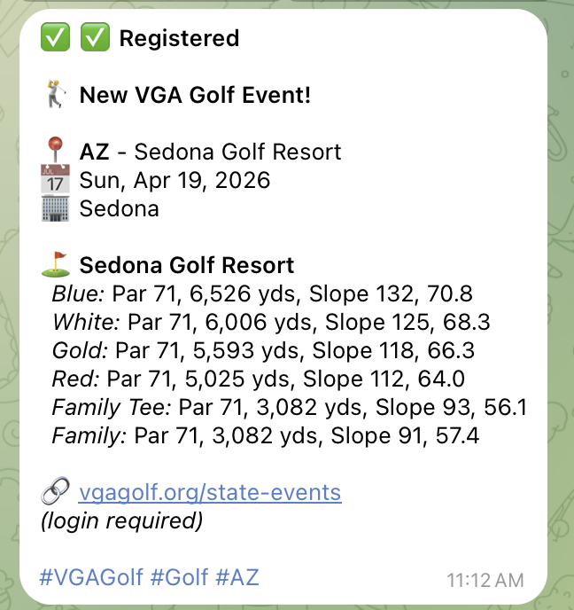

# vga-events

A simple, reliable CLI tool to check for newly-added VGA Golf state events without logging in.

## 🚀 Getting Started with the Telegram Bot

Get instant notifications for new VGA golf events directly in Telegram!

**Start now:** [@VGAEventsBot](https://t.me/VGAEventsBot)

<div align="center">
  
  <p><em>Example notification with golf course details</em></p>
</div>

### Quick Setup (30 seconds)

1. **Open the bot:** Click [@VGAEventsBot](https://t.me/VGAEventsBot) or search for `@VGAEventsBot` in Telegram
2. **Start chatting:** Send `/start` to begin
3. **Subscribe to states:**
   ```
   /subscribe NV
   /subscribe CA
   /subscribe AZ
   ```
4. **Done!** You'll get notified when new events are posted

### Popular Commands

- `/menu` - Interactive menu with buttons
- `/my-events` - See events you're tracking (interested/registered)
- `/search <keyword>` - Find specific events (e.g., `/search "Pebble Beach"`)
- `/near <city>` - Find events near a location (e.g., `/near Las Vegas`)
- `/note <event_id> <text>` - Add personal notes to events
- `/filter` - Set up custom filters (dates, courses, weekends, etc.)
- `/bulk` - Perform bulk operations on multiple events
- `/reminders` - Set up event reminders (1, 3, 7, or 14 days before)
- `/settings` - Configure digest mode (immediate/daily/weekly)
- `/export-calendar` - Download events as .ics calendar file
- `/help <command>` - Get detailed help for any command

### Security & Privacy

✅ **Encrypted** - Your data is protected with AES-256-GCM encryption
✅ **Rate-limited** - 10 commands/minute to prevent spam
✅ **Private** - Each user has separate, isolated preferences
✅ **No login required** - Just start chatting!
✅ **Structured logging** - Sanitized logs that never expose sensitive data
✅ **Test coverage** - 82.3% code coverage across core modules

---

## Features

### CLI Tool
- Check for new events by state (e.g., `NV`) or all states
- Tracks events across runs using local snapshots
- Reports only new events since last check
- Extracts event dates from the website
- Sort events by date, state, or title
- View all tracked events with `--show-all`
- JSON or text output formats
- Exit codes for easy scripting

### Telegram Bot (v0.7.0+)
- **Security features** - Rate limiting, data encryption, input validation, structured logging
- **Advanced filtering** - Create custom filters by date, course, city, weekends-only, and save presets
- **Event deduplication** - See when events appear in multiple states with "Also in:" display
- **Bulk operations** - Register, add notes, or set status for multiple events at once
- **Contextual help** - Detailed help for any command with `/help <command>`
- **Golf course information** - Detailed course data with all tee options, par, yardage, slope, and ratings
- **Personalized notifications** - Each user gets their own subscriptions
- **Manual checks** - `/check` command to instantly check for new events
- **Event tracking** - Mark events as interested/registered/maybe/skip
- **Event notes** - Add personal notes to events (encrypted)
- **Location search** - Find events near a specific city
- **Event reminders** - Get reminded 1 day, 3 days, 1 week, or 2 weeks before events
- **Digest modes** - Choose immediate, daily, or weekly notifications
- **Calendar export** - Download events as .ics files
- **Multi-user support** - Separate preferences for each user
- **Social features** - Friend invitations and shared event tracking

## Installation

### Homebrew (macOS/Linux)

```bash
brew install pfrederiksen/tap/vga-events
```

### Go Install

```bash
go install github.com/pfrederiksen/vga-events@latest
```

### Build from Source

```bash
git clone https://github.com/pfrederiksen/vga-events.git
cd vga-events
go build
```

## Usage

Check for new Nevada events:
```bash
vga-events --check-state NV
```

Check all states:
```bash
vga-events --check-state all
```

Get JSON output:
```bash
vga-events --check-state all --format json
```

Refresh/reset snapshot:
```bash
vga-events --check-state all --refresh
```

Show all tracked events (not just new ones):
```bash
vga-events --check-state NV --show-all
vga-events --check-state all --show-all --format json
```

Sort events by title:
```bash
vga-events --check-state all --sort title
```

Check version:
```bash
vga-events --version
```

### Flags

- `--check-state <STATE|all>` - Required. Check specific state or all states
- `--format <text|json>` - Output format (default: text)
- `--sort <date|state|title>` - Sort order (default: date)
- `--data-dir <path>` - Data directory (default: ~/.local/share/vga-events)
- `--refresh` - Recreate snapshot without showing new events
- `--show-all` - Show all tracked events, not just new ones
- `--verbose` - Show debug logs
- `--version, -v` - Show version information

### Exit Codes

- `0` - No new events (or --refresh/--show-all mode)
- `2` - New events found
- `1` - Error occurred

## Cron Usage

Check for Nevada events daily at 8 AM:
```cron
0 8 * * * /usr/local/bin/vga-events --check-state NV && echo "New NV events!" | mail -s "VGA Events" you@example.com
```

Check all states and get notified if new events exist:
```bash
#!/bin/bash
if vga-events --check-state all; then
    # Exit code 2 means new events
    if [ $? -eq 2 ]; then
        # Send notification
        vga-events --check-state all | mail -s "New VGA Events" you@example.com
    fi
fi
```

## Telegram Bot (Interactive + Personalized Notifications)

Get personalized VGA event notifications via Telegram! The bot supports multiple users, each with their own state subscriptions.

### Quick Start

1. **Create your bot:**
   - Message @BotFather on Telegram
   - Send `/newbot` and follow instructions
   - Save your bot token

2. **Start chatting with your bot:**
   - Click the link BotFather provides
   - Send `/help` to see available commands
   - Use `/subscribe NV` to subscribe to Nevada events
   - Use `/list` to see your subscriptions

### Bot Commands

Send these commands to your bot in Telegram:

**Essential Commands:**
- `/start` - Start the bot and see welcome message
- `/menu` - Quick actions menu with buttons
- `/help` - Show help message with all commands
- `/help <command>` - Get detailed help for a specific command (e.g., `/help filter`)
- `/subscribe <STATE>` - Subscribe to a state's events (e.g., `/subscribe NV`)
- `/unsubscribe <STATE>` - Unsubscribe from a state (e.g., `/unsubscribe CA`)
- `/unsubscribe all` - Unsubscribe from all states with confirmation
- `/manage` - Manage your subscriptions with buttons
- `/list` - Show your current subscriptions
- `/check` - Manually check for new events right now

**Event Discovery:**
- `/search <keyword>` - Search for events (e.g., `/search "Pine Valley"`)
- `/near <city>` - Find events near a city (e.g., `/near Las Vegas`)
- `/events` - View all events for your subscribed states
- `/my-events` - View events you've marked as interested/registered
- `/check` - Check for new events right now (doesn't wait for hourly check)
- `/export-calendar` - Download all events as .ics calendar file

**Golf Course Information:**
Events automatically include detailed course data when available:
- All tee options (Black, Blue, White, Gold, etc.)
- Par, yardage, slope rating, and course rating for each tee
- Powered by golfcourseapi.com (~30,000 courses worldwide)
- Cached for 30 days to minimize API usage

**Event Notes:**
- `/note <event_id> <text>` - Add a personal note to an event
- `/note <event_id> clear` - Remove a note from an event
- `/notes` - List all events with notes

**Event Filtering:**
- `/filter` - Show current filter status or interactive filter menu
- `/filter date <range>` - Filter by date (e.g., `Mar 1-15`, `March`, `Apr 1 - May 15`)
- `/filter course <name>` - Filter by course name (e.g., `Pebble Beach`)
- `/filter city <name>` - Filter by city
- `/filter weekends` - Show only weekend events
- `/filter state <STATE>` - Filter by specific state(s) within subscriptions
- `/filter save <name>` - Save current filter as a preset
- `/filter load <name>` - Load a saved filter preset
- `/filter clear` - Clear all active filters
- `/filters` - List all saved filter presets

**Event Deduplication:**
Events that appear in multiple states are automatically deduplicated with "Also in:" notation showing all states where the event is listed.

**Bulk Operations:**
- `/bulk` - Show bulk operations menu with interactive buttons
- `/bulk register <id1> <id2> ...` - Mark multiple events as registered
- `/bulk note <id1,id2> <text>` - Add same note to multiple events
- `/bulk status <status> <id1> <id2>` - Set status for multiple events

**Event Tracking:**
When you receive event notifications, use the status buttons to track them:
- ⭐ **Interested** - Events you want to attend
- ✅ **Registered** - Events you've signed up for
- 🤔 **Maybe** - Events you're considering
- ❌ **Skip** - Events you're not interested in

**Statistics:**
- `/stats` - View your activity statistics
- `/stats week` - This week's stats
- `/stats month` - Last 30 days
- `/stats all` - All-time statistics
- Track events viewed, marked, and registered

**Reminders:**
- `/reminders` - Configure event reminders (1 day, 3 days, 1 week, or 2 weeks before)
- Get reminded about events you've marked as ⭐ Interested or ✅ Registered

**Notification Settings:**
- `/settings` - Configure notification mode:
  - Immediate (default) - Get notified right away
  - Daily digest - Receive a daily summary at 9 AM UTC
  - Weekly digest - Receive a weekly summary on Mondays
- `/notify-removals on|off` - Toggle notifications when events are removed or cancelled

**Social Features:**
- `/invite` - Generate an invite code to share with friends
- `/join <code>` - Join using a friend's invite code
- `/friends` - View your friends list
- See which friends are registered for events (opt-in with privacy controls)

**Multi-User Support:** Each person gets their own subscriptions, event tracking, and reminder preferences!

### GitHub Actions Setup (Automated Notifications)

The bot runs on GitHub Actions - no server needed! It:
- Checks for commands every 15 minutes
- Checks for new events every hour
- Sends personalized notifications to each user based on their subscriptions

**Required Secrets:**

1. **Create a GitHub Gist** to store user preferences:

   **Option A: Using GitHub CLI (recommended)**
   ```bash
   echo '{}' | gh gist create --filename "vga-events-preferences.json" --desc "VGA Events Bot Preferences" -
   ```

   **Option B: Using the helper script**
   ```bash
   # Get a GitHub token with 'gist' scope from https://github.com/settings/tokens
   ./scripts/create-gist.sh YOUR_GITHUB_TOKEN
   ```

   Both methods will output a Gist ID.

2. **Add repository secrets** (Settings → Secrets and variables → Actions):
   - `TELEGRAM_BOT_TOKEN` - Your bot token from @BotFather
   - `TELEGRAM_GIST_ID` - The Gist ID from step 1
   - `TELEGRAM_GITHUB_TOKEN` - GitHub token with 'gist' scope
   - `TELEGRAM_ENCRYPTION_KEY` - (Recommended) Strong passphrase for data encryption
   - `GOLF_COURSE_API_KEY` - (Optional) API key from golfcourseapi.com for course info

3. The workflows will start running automatically:
   - Commands processed every 15 minutes
   - Notifications sent hourly

### Local Testing

For development or testing locally:

```bash
# Set environment variables
export TELEGRAM_BOT_TOKEN=your_bot_token
export TELEGRAM_GIST_ID=your_gist_id
export TELEGRAM_GITHUB_TOKEN=your_github_token
export TELEGRAM_ENCRYPTION_KEY=your_strong_passphrase  # Recommended: enables data encryption
export GOLF_COURSE_API_KEY=your_golf_api_key          # Optional: enables course info

# Process bot commands manually
./vga-events-bot

# Send notifications manually
./vga-events --check-state all --format json | ./vga-events-telegram --chat-id YOUR_CHAT_ID
```

### Security Features

The bot includes multiple security layers:

**Rate Limiting:**
- Per-user rate limiting (10 commands/minute) prevents spam and DoS attacks
- Automatic cleanup to prevent memory growth

**Data Encryption:**
- Optional AES-256-GCM encryption for sensitive data (notes, event statuses, invite codes)
- PBKDF2 key derivation with 100,000 iterations
- Backward compatible with unencrypted data
- Enable with `TELEGRAM_ENCRYPTION_KEY` environment variable

**Input Validation:**
- Length limits on all user inputs (notes: 500 chars, searches: 100 chars)
- Control character sanitization
- Validation before processing

**Storage Security:**
- Local snapshots use 0600 permissions (owner-only access)
- GitHub Gist preferences stored privately
- No sensitive data in error messages

**Structured Logging:**
- JSON-formatted logs for easy parsing and analysis
- Sanitized error messages that never expose sensitive data
- Operation metrics tracking (counters, gauges, timings)

### How It Works

1. **User subscribes** via `/subscribe NV` command
2. **Bot processes command** (runs every 15 minutes via GitHub Actions)
3. **Preferences stored** in private GitHub Gist (encrypted if key provided)
4. **Event checking** runs hourly via GitHub Actions
5. **Personalized notifications** sent only for subscribed states
6. **Each user** receives only their relevant events

## How It Works

1. Fetches the public state events page from vgagolf.org
2. Parses event listings (state code, course, date, city)
3. Generates deterministic IDs for each event
4. Compares with previous snapshot
5. Reports new events and saves updated snapshot

## Development

See [CLAUDE.md](CLAUDE.md) for development workflow.

## Author

Created by **Paul Frederiksen** ([@iamdesertpaul](https://t.me/iamdesertpaul))

For questions, issues, or feedback about the Telegram bot, reach out on Telegram: @iamdesertpaul

## License

MIT License - see [LICENSE](LICENSE)
